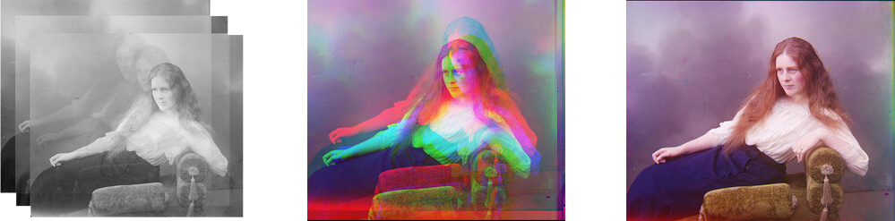
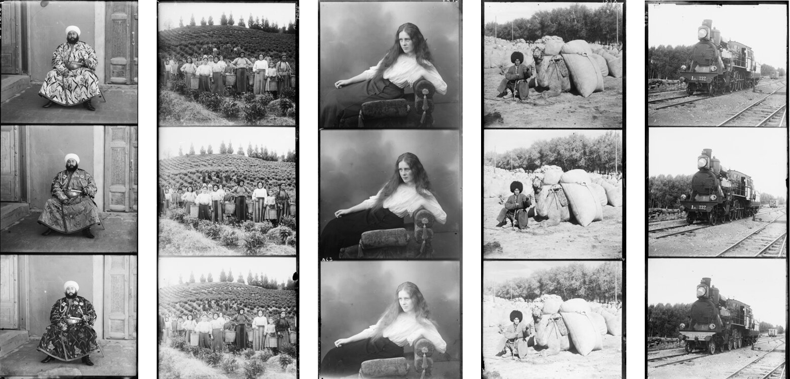
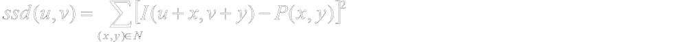
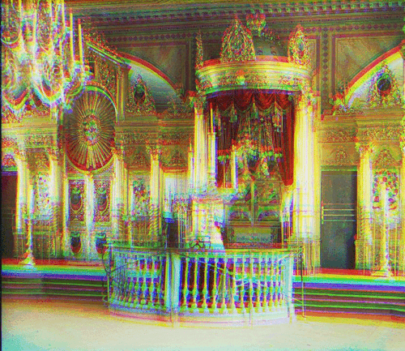
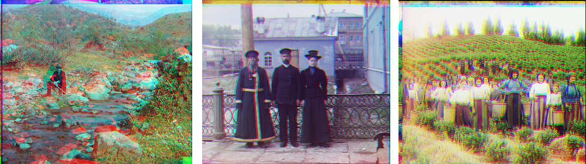
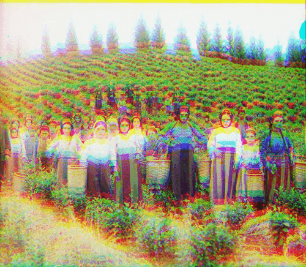
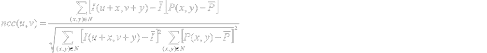
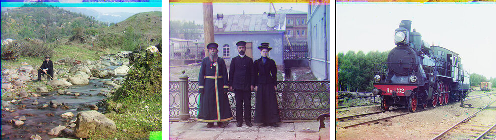
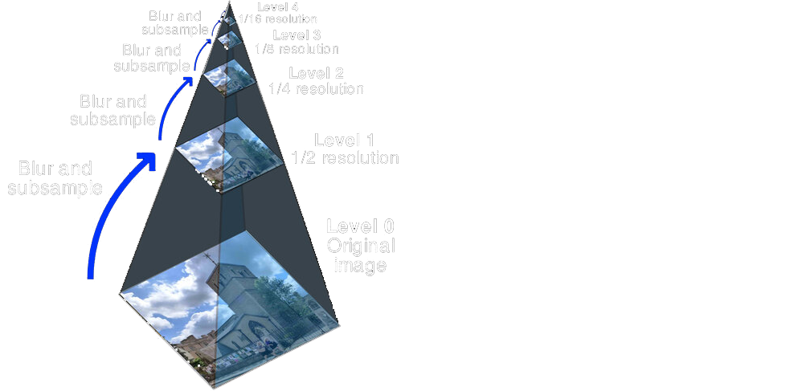
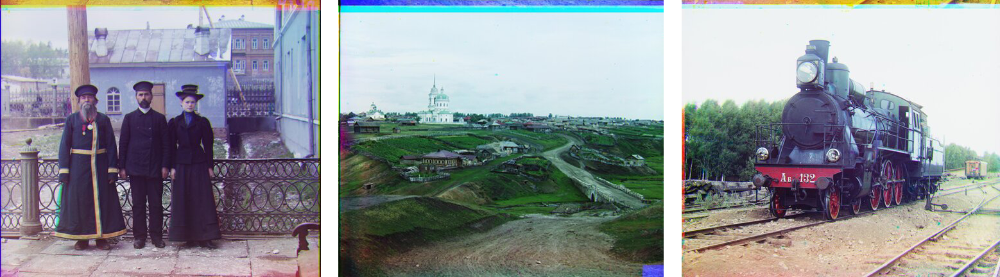

# Photo Colorization Tool

<br>



<br>

## About 

This study proposes a computational method to autonomously colourize black and white photograph within the Prokudin-Gorskii Photo Collection using image processing techniques. 

## Project Page

An expanded description of this model implimentation can be found on its project page here:

<br>

```
https://www.michaelhasey.com/prokudin-gorskii-colorization-algorithm
```

## Table of Contents

<br>

- [Background](#Background)
- [Dataset](#Dataset)
- [Model-Architecture](#Model-Architecture)
- [Implementation-Details](#Implementation-Details)
- [Command-Line-Arguments](#Command-Line-Arguments)
- [Performance](#Performance)
- [References](#References)
- [Citation](#Citation)

<br>

## Background

<br>

The Prokudin-Gorskii Photo Collection are a series of black and white photos of the Russian Empire taken by Sergei Mikhailovich Prokudin-Goirskii in the early 20th century.  In addition to being grayscale, each photograph is in fact a montage of three copies of the same image stacked one above the other.  Each copy within the montage represents one of the three channels of the RGB color spectrum.  The images are stacked with the blue channel image on top,  the green channel image in the middle, and the red channel on the bottom.  
 
The aim of this study was to use image processing techniques to autonomously and efficiently split the image into its three parts, align and stack them correctly to produce a colour image, and apply efficient coding methodologies and techniques such as image pyramiding to complete this task in a very short period of time when applied to very large images.

<br>

## Dataset

<br>

The dataset includes various images within the Prokudin-Gorski Photo Collection.  As described above, each photo is in the form of a montage of three copies of the same image.  Each representing one channel of the RGB spectrum.  Each image is in .tif format.

<br>



<br>

An example image is included and can be found here: 


```
data/village.tif
```

<br>


## Approach

<br>


### Method 1: Sum of Square Differences (SSD)

The first and simplest method is finding the sum of square differences (SSD) - also known as the L2 norm - between the images.  This method simply compares the average sum of pixel values between two images and returns the difference.  The SSD formula is shown below. 



As a result, a SSM value of 0 means that the images compared are the same and aligned perfectly.   And thus, lower SSM values correspond with images that are more aligned, and higher SSM values correspond with images that are less aligned.  In order to find the lowest SSM value and best alignment location, I used the numpy function np.roll to shift single images within a range of possible locations.   These possible locations are confined within a pixel range specified by the user.  For example a 15x15 pixel range, would result in the image being slightly shifted 225 times within that range.  Once shifted, the SSD value would be calculated again.  Once all shifts have been made, the shift with the lowest SSD value is chosen and applied to the image in order to achieve the best shift and thus, alignment.  



In this study, both the green and red channels were shifted via this method to align with the blue channel.  Though this method worked well with some images (see image to right), I soon discovered that it was fairly inconsistent and slow with many misaligned image results (see below). 



<br>

### Method 2: Normalized Cross Correlation (NCC)

The second method is called normalized cross-correlation (NCC), which scores image alignment via the dot product between two normalized vectors.  Like the SSD method, I aligned the Red and Green channels with the blue channels by cycling through a range of possible displacements by using the np.roll. (np.roll() is a numpy function that shifts array elements, in this case image array elements, along a specified axis in order to determine whether a new alignment is better aligned to the base image via the SSD or NCC method.)   However, opposite to SSD a higher score indicates better alignment while a low score indicates less alignment.  The NCC formula is shown below





After implementation, I achieved better results with more correct alignments.  However, certain images (ie. the “Emir” image) continued to present problems and was not able to be aligned.  All other images were successfully aligned nonetheless. 



<br>

### Processing Large Images Quickly

In step 3, it was determined that the NCC method produced the most accurately aligned images.  Thus, I decided to apply the NCC algorithm to the full size image plates.  However, I soon realized that the sheer size of the image (3741x9732 pixels, 83.6 MB) compared to the smaller test images previously used (923x2400 pixels, 4.5 MB) was extremely taxing on the algorithm and slowed the alignment process down immensely. To speed up the alignment process for large, full-size images, I constructed a recursive “Image Pyramid” framework which dramatically reduced processing time to around 6 seconds per image.  



Structurally, an image pyramid exists as a series of downsampled images that represent progressively lower resolution versions of a larger target image.  To situate this in space, one can imagine the smallest and lowest resolution image at the top of the pyramid and the largest and highest resolution image at the bottom.  A series of other image copies exist in between and reduce in size and resolution as they travel up the pyramid.  Image pyramids are unique as they allow typical process heavy functions to be quickly carried out on the smallest image, with results being upsampled and applied to the largest image.  The benefit of this is reduced process time.  However, the results of these processes carried out on the smallest images are less precise due to their lower resolution.  To achieve more precision, one can move down the pyramid and carry out these processes on higher resolution images, thus increasing precision.  However, when operated in conjunction in a recursive manner, the results of one layer can be shared amongst the rest of the pyramid layers, thus incrementally increasing precision overall with the largest gains achieved  in the smallest and  fastest layers and the smallest and more precise gains being achieved in the largest.

<br>

## Implementation

<br>

For this study, Method 2: NCC was determined to produce the best colorization results.  In combination with Image Pyramiding, we were able to apply this method to efficiently and rapidly colorize the largest full-size images of the  Prokudin-Gorskii Photo Collection.

### Jupyter Notebooks

A notebook implimentation of my approach can be found here.

```
main_single_scale.ipynb (without image pyramiding)
main_multi_scale.ipynb (with image pyramiding)
```

<br>

## Performance

<br>

Using the NCC method in combination with image pyramiding, I was able to colorize large full-size photos within an average of just 6 seconds.

<br>



<br>

## References

<br>

This project was completed as part of Carnegie Melon University's Learning Based Image Synthesis course 16 726 taught by Jun-Yan Zhu in Spring of 2021.

## Citation

<br>

If you find this project useful in your research, please consider citing:

``` 
@misc{mhasey2021,
    title={Photo Colorization Tool},
    author={Michael Hasey},
    year={2021},
}
```
